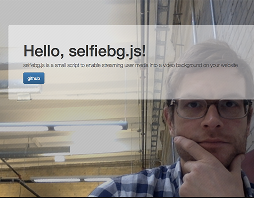

# selfiebg.js
-----------
##introduction
**selfiebg.js** is a small script that injects and allows you to use the users web cam and streaming media as a video background to your website, kinda letting you allow your users to make the site their own

### design pattern
**selfiebg.js** is built on a module reveal pattern exposing three (3) core methods.

* setup()
* start()
* stop()

### usage
**selfiebg.js** is an IIFE *(immediately-invoked function expression)* and executes the **setup()** method on load, simply include the file at the bottom of your html page before the closing ***body*** tag

<pre>
	/*
	** @description include selfiebg.js or selfiebg.min.js
	*/
	&lt;script src="selfiebg.min.js"&gt;&lt;/script&gt;
&lt;/body&gt;
</pre>

### options
you can set the boolean value of **button_require**, by default it is set to ***false***
setting the boolean value to ***true*** creates a button that allows the user to terminate the user media stream by invoking the **stop()** method 

##example
----------
Below is a quick screengrab of the script running once the user allows the sharing of their camera *(yep, it's a pitcure of me)*

view the [example](example.html) file for more information.

